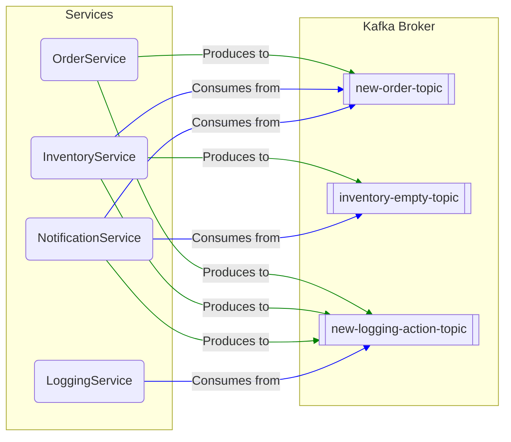
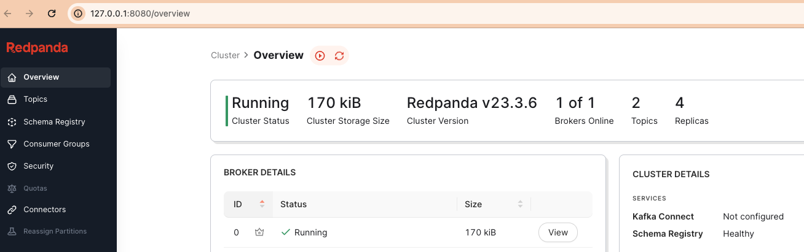
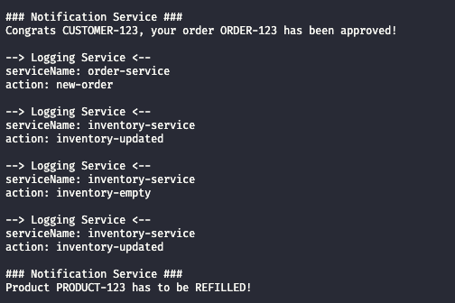
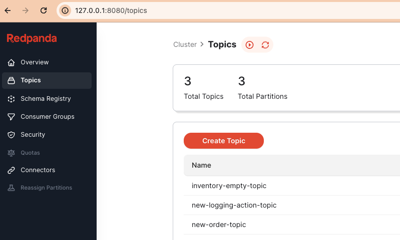
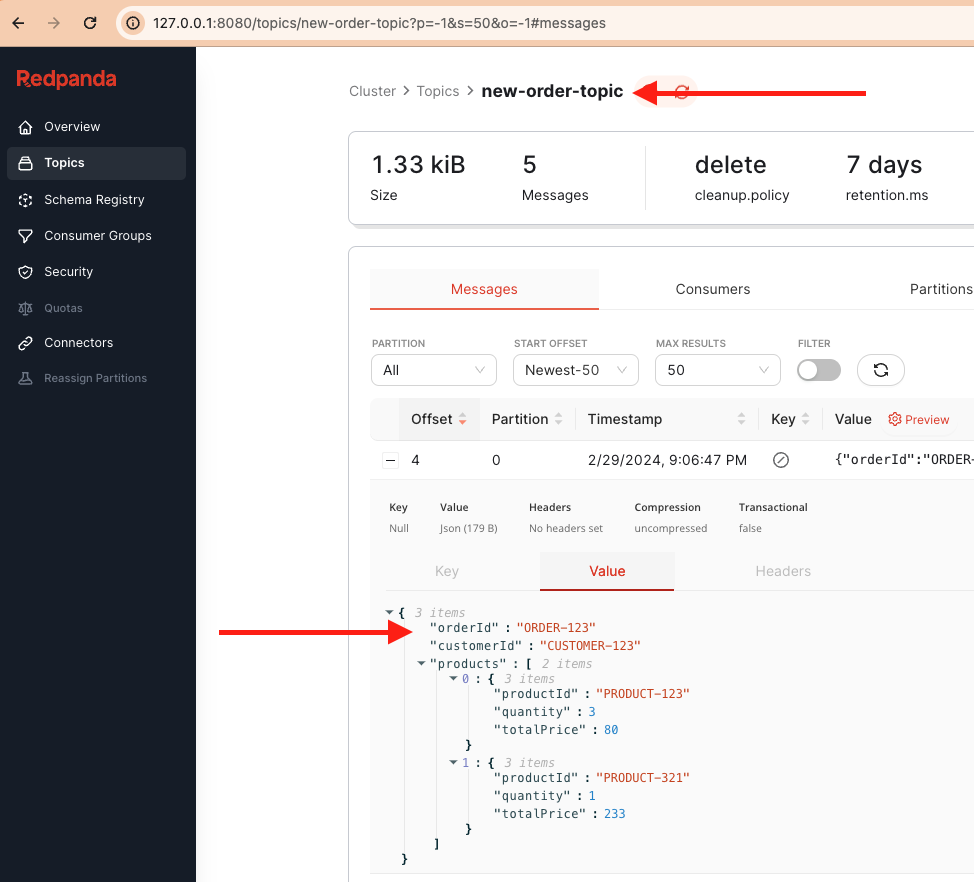

# What is Kafka in a nutshell?

Kafka is a distributed streaming platform designed for handling real-time data feeds with high throughput and fault tolerance. It operates through servers and clients communicating via a high-performance TCP network protocol. Kafka can be deployed on various infrastructures including bare-metal hardware, virtual machines, and containers, both on-premise and in cloud environments.

To comprehend Kafka thoroughly, it's essential to understand these key definitions:

- **Topic**: think of a topic as a category or a channel where messages are organized and published. It's like a virtual inbox or bulletin board where messages related to a specific theme or subject are posted.
- **Event**: represents a piece of data or a message denoting a specific action or occurrence, which is transmitted to a topic.
- **Producer**: acts as a sender or publisher, generating and dispatching events to topics.
- **Consumer**: is like a receiver or a subscriber that reads and processes events from topics. It's responsible for fetching and handling messages from the topics it subscribes to.

# How does it work?

Let's illustrate Kafka's functionality using an e-commerce scenario with a distributed system:

- **Order Service**: responsible for managing product listings and the checkout process.
- **Inventory Service**: handles updates to product quantities
- **Notification Service**: sends notifications to users
- **Logging Service**: tracks activities across services

In this scenario, we define topics, producers, consumers, and the event contract as follows:

#### Topics

- **new-order-topic**: receives events related to new orders
- **inventory-empty-topic**: receives events regarding product inventory consumption
- **new-logging-action-topic**: receives events related to new actions from other services

#### Consumers

- **Inventory Service**: consumes events from **new-order-topic**
- **Notification Service**: consumes events from **new-order-topic** and **inventory-empty-topic**
- **Logging Service**: consumes events from **new-logging-action-topic**

#### Producers

- **Order Service**: produces events for **new-order-topic** and **new-logging-action-topic**
- **Inventory Service**: produces events for **inventory-empty-topic** and **new-logging-action-topic**
- **Notification Service**: produces events for **new-logging-action-topic**

#### Events Contract per Topic

- **new-order-topic**:

```Typescript
{
  orderId: string,
  customerId: string,
  products: [
    {
      productId: string,
      quantity: number,
      totalPrice: number
    }
  ]
}
```

```JSON
// Sample
{
  "orderId": "ORDER-123",
  "customerId": "CUSTOMER-123",
  "products": [
    {
      "productId": "PRODUCT-123",
      "quantity": 3,
      "totalPrice": 80
    },
    {
      "productId": "PRODUCT-321",
      "quantity": 1,
      "totalPrice": 233
    }
  ]
}
```

- **inventory-empty-topic**:

```Typescript
{
  productId: string,
}
```

```JSON
// Sample
{
  "productId": "PRODUCT-123"
}
```

- **new-logging-action-topic**:

```Typescript
{
  serviceName: string,
  action: string,
}
```

```JSON
// Sample
{
  "serviceName": "order-service",
  "action": "new-order",
}
```

The diagram below illustrate how it works:



That's it, we have all in place to start the hands-on! 🚀🚀🚀

# Hands-on

### Prerequisites

To follow this guide, ensure you have the following requirements:

- Node.js 18+: If you haven't installed Node.js on your machine yet, you can download the installer from the [official Node.js website](<(https://nodejs.org/en/download)>). Once downloaded, launch the installer and follow the installation wizard.
- Docker: Docker is required to set up Kafka on your computer. If you haven't installed Docker yet, you can follow the installation guide for your operating system provided in the [official Docker documentation](https://docs.docker.com/get-docker/).

The following sub-chapters outline the main steps to start using Kafka with Node.js. To avoid confusion and ensure a smooth process, we recommend keeping the codebase of the final application accessible. You can achieve this by cloning the GitHub repository associated with this article:

```
git clone https://github.com/manganellidev/dev-to-hands-on-kafka.git
```

This will give you easy access to the code examples and configurations used throughout the guide.

### Set Up Your Kafka Project

**Create a Project Folder**: Start by creating a folder for your Node.js application and navigate into it:

```bash
mkdir hands-on-kafka
cd hands-on-kafka
```

**Initialize npm Project**: Run the following command to bootstrap a new npm project:

```bash
npm init -y
```

**Install Dependencies**: Install kafkajs to your project's dependencies:

```bash
npm install kafkajs
```

**Add Docker Configuration**: Copy the `docker-compose.yml` file from the GitHub repository to the root folder of your project.

**Organize Project Structure**: Create a `src/` folder and within it, create an `index.js` file. Additionally, create the following subfolders: `lib/`, `db/`, and `services/`.

**Create Modules**: Inside the `services/` folder, create a module for each service. Similarly, create modules for the Kafka client and the in-memory database. Here's how your project directory should be structured:

```
hands-on-kafka/
├── node_modules/
├── src/
│    └── db
│      └── inventory.js
│    └── lib
│      └── kafka-client.js
│    └── services
│      └── order-service.js
│      └── inventory-service.js
│      └── notification-service.js
│      └── logging-service.js
│      └── kafka-client.js
│    └── index.js
├── docker-compose.yml
├── package-lock.json
├── package.json
└── README.md
```

**Update `package.json`**

- **Enable ES Modules**: Add the type configuration to enable ES Modules:

```json
"type": "module"
```

- **Add Start Script**: To facilitate running your application, add a start script to the scripts object:

```json
"start": "node index.js"
```

### Index

This file serves as the entry point for the application. It imports all services responsible for consuming and publishing events related to various aspects of the e-commerce system. Additionally, it continuously generates new order events every 5 seconds to simulate ongoing activity within the system.

```Javascript
// Import services responsible for consuming and publishing events
import "./services/inventory-service.js";
import "./services/logging-service.js";
import "./services/notification-service.js";

// Import function to create new order events
import createNewOrder from "./services/order-service.js";

// Define initial order details
const orderOne = {
  orderId: "ORDER-123",
  customerId: "CUSTOMER-123",
  products: [
    {
      productId: "PRODUCT-123",
      quantity: 3,
      totalPrice: 80,
    },
    {
      productId: "PRODUCT-321",
      quantity: 1,
      totalPrice: 233,
    },
  ],
};

// Create the initial order and schedule creation of new orders every 5 seconds
(async () => {
  await createNewOrder(orderOne);

  // Schedule creation of new orders recursively every 5 seconds
  setInterval(() => createNewOrder(orderOne), 5000);
})();
```

### Kafka Client Module

This module configures the Kafka client by specifying the required parameters. Ensure you have the following configuration added:

```Javascript
import { Kafka } from "kafkajs";

// Define constants for client ID and Kafka brokers URL
const CLIENT_ID = "kafka-hands-on";
const BROKERS_URL = ["localhost:29092"];

// Define topics used in the application
export const TOPIC_NEW_ORDER = "new-order-topic";
export const TOPIC_INVENTORY_EMPTY = "inventory-empty-topic";
export const TOPIC_NEW_LOGGING_ACTION = "new-logging-action-topic";

// Initialize Kafka client with specified configuration
const kafkaClient = new Kafka({ clientId: CLIENT_ID, brokers: BROKERS_URL });

export default kafkaClient;
```

Ensure that the `CLIENT_ID` and `BROKERS_URL` variables are correctly set based on your Kafka configuration. This module provides a centralized configuration for the Kafka client, making it easier to manage and reuse throughout your application.

### Services Module

#### Order Service

This service module contains a single function responsible for initiating the messaging process by creating a new order event. Consumers will receive this event asynchronously to perform additional processing.

```Javascript
import kafkaClient, {
  TOPIC_NEW_ORDER,
  TOPIC_NEW_LOGGING_ACTION,
} from "../lib/kafka-client.js";

// Initialize Kafka producer
const producer = kafkaClient.producer();

const createNewOrder = async (input) => {
  try {
    // Connect to Kafka broker
    await producer.connect();

    // Create a new event for the 'new-order-topic'
    await producer.send({
      topic: TOPIC_NEW_ORDER,
      messages: [{ value: JSON.stringify(input) }],
    });

    // Create a new event for the 'new-logging-action-topic'
    await producer.send({
      topic: TOPIC_NEW_LOGGING_ACTION,
      messages: [
        {
          value: JSON.stringify({
            serviceName: "order-service",
            action: "new-order",
          }),
        },
      ],
    });
  } catch (err) {
    console.error(err);
  } finally {
    await producer.disconnect();
  }
};

export default createNewOrder;
```

#### Inventory Service

This service module contains an Immediately Invoked Function Expression (IIFE) that continuously listens to the `new-order-topic` for new events. Upon receiving new order events, it processes and validates the products' inventory, updating the inventory status accordingly. Additionally, it sends events for notifications and logs actions related to inventory management.

```Javascript
import kafkaClient, {
  TOPIC_NEW_ORDER,
  TOPIC_INVENTORY_EMPTY,
  TOPIC_NEW_LOGGING_ACTION,
} from "../lib/kafka-client.js";
import productInventory from "../db/inventory.js";

// Initialize Kafka consumer and producer
const consumer = kafkaClient.consumer({ groupId: "inventory-service-group" });
const producer = kafkaClient.producer();

const sendEventToNotifyProductInventoryIsEmpty = async (productId) => {
  // Create a new event for 'inventory-empty-topic'
  await producer.send({
    topic: TOPIC_INVENTORY_EMPTY,
    messages: [{ value: JSON.stringify({ productId }) }],
  });
  // Create a new event for 'new-logging-action-topic'
  await producer.send({
    topic: TOPIC_NEW_LOGGING_ACTION,
    messages: [
      {
        value: JSON.stringify({
          serviceName: "inventory-service",
          action: "inventory-empty",
        }),
      },
    ],
  });
};

const processAndValidateProductsInventory = async (products) => {
  for (const product of products) {
    const prodQuantity = productInventory.product(product.productId);
    const updatedProdQuantity = prodQuantity - product.quantity;

    // Update product inventory
    productInventory.setProduct(product.productId, updatedProdQuantity);

    await producer.send({
      // create a new event for new-logging-action-topic
      topic: TOPIC_NEW_LOGGING_ACTION,
      messages: [
        {
          value: JSON.stringify({
            serviceName: "inventory-service",
            action: "inventory-updated",
          }),
        },
      ],
    });

    // Check if inventory is below threshold and take appropriate action
    if (updatedProdQuantity <= 100) {
      // Notify product inventory is low and log action
      await sendEventToNotifyProductInventoryIsEmpty(product.productId);

      // Refill product inventory
      productInventory.setProduct(product.productId, 109);
    }
  }
};

// IIFE: Listen for new events on 'new-order-topic'
(async () => {
  // Connect to Kafka broker
  await producer.connect();
  await consumer.connect();

  // Subscribe to 'new-order-topic'
  await consumer.subscribe({
    topics: [TOPIC_NEW_ORDER],
    // get all events from the beginning
    fromBeginning: true, // Start consuming from the beginning
  });

  // Run consumer
  await consumer.run({
    eachMessage: async ({ message }) => {
      const { products } = JSON.parse(message.value);

      await processAndValidateProductsInventory(products);
    },
  });
})();
```

#### Logging Service

This service module listens for events on the new-logging-action-topic and logs the received actions. It continuously runs, ensuring all relevant actions are logged as they occur.

```Javascript
import kafkaClient, { TOPIC_NEW_LOGGING_ACTION } from "../lib/kafka-client.js";

// Initialize Kafka consumer
const consumer = kafkaClient.consumer({ groupId: "logging-service-group" });

// IIFE: Listen for new events on 'new-logging-action-topic'
(async () => {
  // Connect to Kafka broker
  await consumer.connect();

  // Subscribe to 'new-logging-action-topic'
  await consumer.subscribe({
    topics: [TOPIC_NEW_LOGGING_ACTION],
    fromBeginning: true, // Start consuming from the beginning
  });

  // Run consumer
  await consumer.run({
    eachMessage: async ({ message }) => {
      const { serviceName, action } = JSON.parse(message.value);

      console.log(
        `\n--> Logging Service <--\nserviceName: ${serviceName}\naction: ${action}`
      );
    },
  });
})();
```

#### Notification Service

This service module listens for events on the `new-order-topic` and `inventory-empty-topic` and performs specific actions based on the received events. It dynamically calls the appropriate function based on the incoming event topic and logs the corresponding notification.

```Javascript
import kafkaClient, {
  TOPIC_NEW_ORDER,
  TOPIC_INVENTORY_EMPTY,
} from "../lib/kafka-client.js";

// Initialize Kafka consumer
const consumer = kafkaClient.consumer({
  groupId: "notification-service-group",
});

// an object of functions by topics to be called whenever an event arrives from that specific topic
const notificationHandlers = {
  [TOPIC_INVENTORY_EMPTY]: ({ productId }) =>
    console.log(
      `\n### Notification Service ###\nProduct ${productId} needs to be refilled.`
    ),
  [TOPIC_NEW_ORDER]: ({ orderId, customerId }) =>
    console.log(
      `\n### Notification Service ###\nCongrats ${customerId}, your order ${orderId} has been approved!`
    ),
};

// IIFE: Listen for new events on 'new-order-topic' and 'inventory-empty-topic'
(async () => {
(async () => {
  // Connect to Kafka broker
  await consumer.connect();

  // Subscribe to 'new-order-topic' and 'inventory-empty-topic'
  await consumer.subscribe({
    topics: [TOPIC_NEW_ORDER, TOPIC_INVENTORY_EMPTY],
    fromBeginning: true,
  });

  // Run consumer
  await consumer.run({
    eachMessage: async ({ topic, message }) => {
      // Call the appropriate notification handler based on the topic
      notificationHandlers[topic](JSON.parse(message.value));
    },
  });
})();
```

### DB Module

This module contains a single class responsible for storing product quantities. It initializes with default product quantities and provides methods to retrieve and update product quantities.

```Javascript
class ProductInventory {
  #products;

  // Constructor initializes the products Map with default values
  constructor() {
    this.#products = new Map();
    this.#products.set("PRODUCT-123", 109);
    this.#products.set("PRODUCT-321", 109);
  }

  product(id) {
    return this.#products.get(id);
  }

  setProduct(id, value) {
    this.#products.set(id, value);
  }
}

// Export a singleton instance of ProductInventory
export default new ProductInventory();
```

### Running the application

**Start Kafka Broker**: Open a second terminal and start the Kafka broker using the following command:

```bash
docker-compose up
```

**Access Redpanda UI**: Once the containers are up and running, you can access the Redpanda UI, an admin panel for the Kafka broker, by navigating to the following URL in your browser: http://127.0.0.1:8080


**Start the Application**: Return to the primary terminal and start the application using the start script:

```bash
npm start
```

**View Logs**: In the terminal, you will observe logs related to the Logging Service, as shown below:


**Monitor Topics**: In the Redpanda UI, navigate to the Topics menu to view the topics created and populated with events (messages):



> **Note**: You can customize the `orderOne` object in the `index.js` file to observe different behaviors. Additionally, you can adjust the quantity in the `db.js` file.

<br/>
<hr/>
<br/>

That's it! You have successfully set up and run the application.

Happy coding! 🎉🎉🎉
